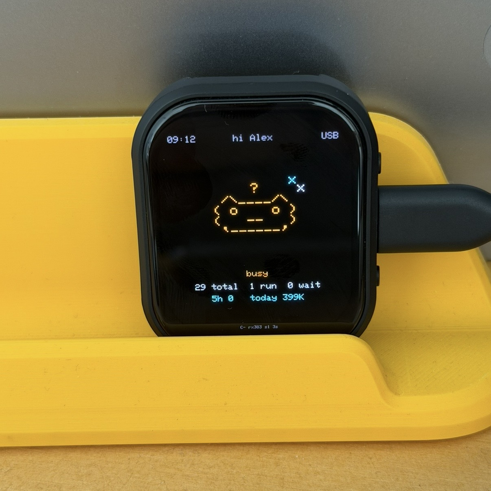
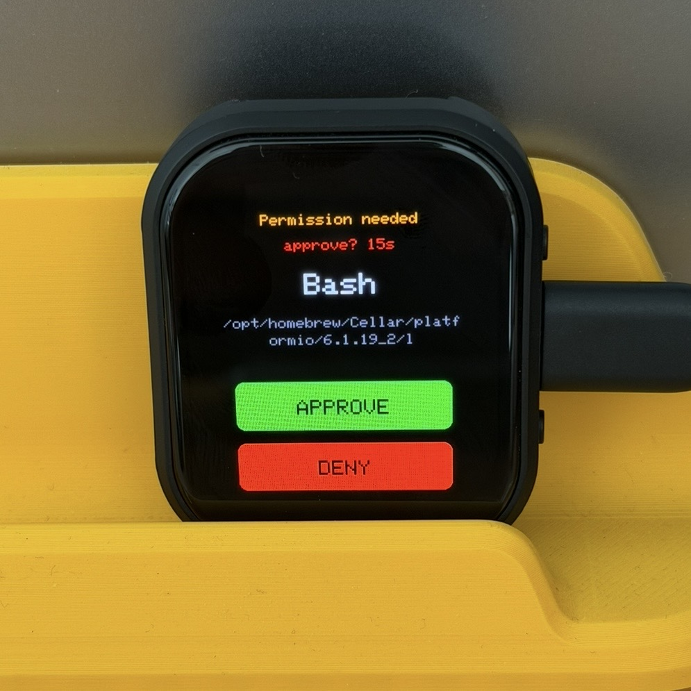

# Claude Hardware Buddy — Waveshare ESP32-S3-Touch-AMOLED-2.06

Firmware that turns the board into a **Claude Hardware Buddy**: it pairs over
BLE with the Claude desktop app (Developer Mode → Hardware Buddy), shows tool
permission prompts on the AMOLED, lets you **Approve / Deny** with the buttons
or touchscreen, and displays a live session overview.

Built from scratch against the documented BLE cable protocol — **not** a fork of
the M5StickC firmware.

| Home / session overview | Permission request |
| --- | --- |
|  |  |

## Build

PlatformIO:
```bash
pio run -t upload && pio device monitor
```
`Arduino_DriveBus` (FT3168) and `Mylibrary` (board pin macros) are not on the
PlatformIO registry — copy the Waveshare-supplied folders into `./lib/`. All
other dependencies are pinned in `platformio.ini`.

Arduino IDE alternative: board *ESP32S3 Dev Module*, **PSRAM: OPI**,
**USB CDC On Boot: Enabled**, Flash 32MB.

## Pairing

1. Desktop app → Help → Troubleshooting → **Enable Developer Mode**.
2. Developer → **Open Hardware Buddy…** → Connect → pick `Claude-XXXX`.
3. A 6-digit passkey shows on the AMOLED — type it into the OS dialog.
4. Link is now AES-CCM encrypted and bonded; reconnects are silent.
`{"cmd":"unpair"}` erases the bond.

## Source map

| File | Responsibility | Milestone |
|------|----------------|-----------|
| `power.cpp`    | AXP2101: open panel rail, read battery        | 1, 6 |
| `display.cpp`  | CO5300 QSPI + LVGL display/flush/tick         | 1, 2 |
| `touch.cpp`    | FT3168 → LVGL pointer indev                   | 2 |
| `ble_link.cpp` | NimBLE NUS, bonding, passkey, `\n` reassembly | 3, 7 |
| `protocol.cpp` | JSON line dispatch, acks, status, perms       | 4, 5, 6 |
| `ui.cpp`       | LVGL screens + buddy state machine            | 4, 5 |
| `rtc.cpp`      | PCF85063 time sync                            | 6 |
| `store.cpp`    | NVS: name/owner/stats                         | 6 |
| `main.cpp`     | boot order + button polling + loop            | all |

State machine (`updateBuddyState`): `waiting>0`→attention, `running>0`→busy,
connected+`total==0`→idle, no heartbeat ≥30s→sleep.

## Threading

NimBLE callbacks run on the BLE host task. They only push reassembled lines into
a critical-section-guarded queue; `loop()` drains it and runs **all** protocol +
LVGL work single-threaded. No locks around `AppState` beyond that queue.

## Verify against the Waveshare demo (`// VERIFY:` in code)

These are the board-specific unknowns implemented with documented defaults —
confirm them against the random demo / `Mylibrary` before trusting:

- **`power.cpp`** — which AXP2101 rail feeds the CO5300 (`DSI_PWR_EN`). Defaults
  to BLDO1/ALDO1/ALDO3 @3.3V. **If the screen is black, look here first.**
- **`config.h`** — `FT3168_ADDR` (default `0x38`) and all pins if `Mylibrary`
  exposes macros (they take precedence via `__has_include`).
- **`display.cpp`** — RGB565 byte-swap. If colors are inverted/wrong, drop the
  `lv_draw_sw_rgb565_swap` call and use `draw16bitRGBBitmap` directly.

## NimBLE version note

Written for **NimBLE-Arduino 1.4.x** callback signatures. On 2.x the server /
security callbacks take `NimBLEConnInfo&` instead of `ble_gap_conn_desc*` —
see the `2.x:` comments in `ble_link.cpp`.

## Not implemented (phase 2)

Pet animation states, QMI8658 shake-to-wake, and folder/GIF push are stubbed
out. Folder push (`char_begin`) is intentionally **not** acked so the desktop
times out and aborts cleanly. If you add it: validate `file.path`, reject `..`
and absolute paths.
